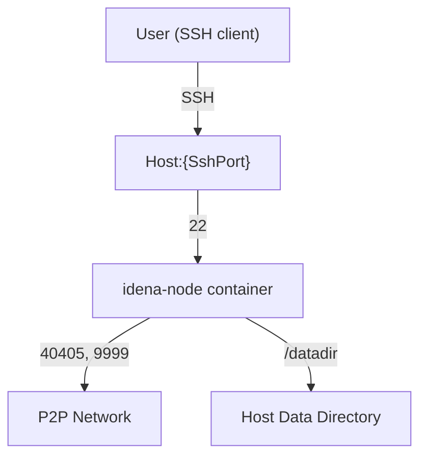

# idena-node Docker Image

[](https://hub.docker.com/repository/docker/rinzlerfr/idena-node)
[](https://hub.docker.com/repository/docker/rinzlerfr/idena-node)
[](https://hub.docker.com/repository/docker/rinzlerfr/idena-node)
[](https://github.com/Rinzler78/docker.idena-node/stargazers)
[](https://github.com/Rinzler78/docker.idena-node/network/members)
[](https://github.com/Rinzler78/docker.idena-node/issues)
[](https://github.com/Rinzler78/docker.idena-node/commits/master)
[](https://github.com/Rinzler78/docker.idena-node/issues)
[](https://opensource.org/licenses/MIT)
[](https://github.com/Rinzler78/docker.idena-node)

## Purpose

This repository provides everything needed to build a Docker image containing all necessary components to run an idena-node.

For more information about the Idena project, visit: <https://idena.io/>

Downloads and client installation: <https://idena.io/?view=download#>

## Prerequisites

- Docker (version 20+ recommended)
- Supported OS: Linux, macOS, Windows (with Docker)
- At least 2GB RAM and 2GB free disk space
- Internet connection

## Architecture Diagram



## Table of contents

* [Purpose](#purpose)
* [docker creation](#docker-creation)
  * [Dockerfile details](#dockerfile-details)
  * [Build instructions](#build-instructions)
  * [Before run](#before-run)
  * [Run instructions](#run-instructions)
  * [Public docker image](#public-docker-image)
* [Synology NAS Docker deployment](#synology-nas-docker-deployment)
  * [1. Install Docker](#1-install-docker)
  * [2. Search for idena-node image](#2-search-for-idena-node-image)
  * [3. Create the data directory](#3-create-the-data-directory)
  * [4. Add your API key](#4-add-your-api-key)
  * [5. Migrate existing node data (optional)](#5-migrate-existing-node-data-optional)
  * [6. Configure and start the container](#6-configure-and-start-the-container)
* [FAQ / Troubleshooting](#faq--troubleshooting)
* [Support](#support)

## docker creation

### Dockerfile details

#### Base image

This container is based on `ubuntu:latest`.

#### Installed packages

The following packages are installed:

* wget: Allows downloading the idena-node binary from GitHub (<https://github.com/idena-network/idena-go/releases>)
* openssh-server: Allows SSH client connection to the node.
* curl and wget: Used to update idena-node

#### idena-node installation

The idena-node binary is downloaded, placed at `/bin/idena-node`, and made executable.

#### Exposed ports

The following ports are exposed (<https://idena.io/?view=guide#guide-remote-1>):

* 22 (SSH)
* 40405 (P2P)
* 9999 (API)

#### Volumes

A `datadir` directory is created at the root (`/datadir`).
It must be mapped to a directory outside the container.

#### Environment variables

* `IDENA_USER_ACCOUNT_NAME`: SSH user account name to be created.
* `IDENA_USER_ACCOUNT_PASS`: SSH user account password.

#### Start script

The `startIdena.sh` script is called at container startup. It performs the following actions:

* Creates the SSH user (`IDENA_USER_ACCOUNT_NAME`) with the specified password if it does not exist.
* Creates a `config.json` file in `/datadir` if it does not exist.
* Starts the SSH service.
* Checks for a newer version of idena-node at <https://github.com/idena-network/idena-go/releases/latest>
* Starts the idena-node binary

### Environment Variables Summary

| Variable                   | Description                        | Required | Default |
|----------------------------|------------------------------------|----------|---------|
| IDENA_USER_ACCOUNT_NAME    | SSH user account name               | Yes      | -       |
| IDENA_USER_ACCOUNT_PASS    | SSH user account password           | Yes      | -       |

### Build instructions

To build the Docker image, run:

```sh
docker build -t idena-node .
```

### Update instructions

To update your container to the latest version:

1. Pull the latest image:
   ```sh
   docker pull rinzlerfr/idena-node
   ```
2. Stop and remove the existing container (your data in /datadir will be preserved):
   ```sh
   docker stop idena-node
   docker rm idena-node
   ```
3. Run the container again with the same command as before (see below).

### Before run

#### Prepare the data directory

Create a directory on your Docker host to be mapped to the container's /datadir. Example:

```sh
mkdir -p ~/MyDockers/idena-node/datadir
```

#### API key

Copy your `api.key` into the data directory. Example:

```sh
cp /path/to/your/api.key ~/MyDockers/idena-node/datadir/api.key
```

#### Existing node data

If you are already using idena-node (locally or on a VPS) and want to migrate to Docker, copy all files and directories from your current datadir to the new datadir on your Docker host.

### Run instructions

docker run command is :
```
docker run -d \
--restart unless-stopped \
-p {SshPort}:22 \
-p 40405:40405 \
-p 9999:9999 \
-v {Your directory}:/datadir \
-e IDENA_USER_ACCOUNT_NAME={User Account} \
-e IDENA_USER_ACCOUNT_PASS={User Account Password} \
--name idena-node idena-node
```
Where :

* {SshPort} => SSH port to open
* {Your directory} => Your datadir directory on the docker host
* {User Account} => The ssh user account used to connect client to node
* {User Account Password} => The ssh user account password.

Exemple :
```
docker run -d \
--restart unless-stopped \
-p 60022:22 \
-p 40405:40405 \
-p 9999:9999 \
-v docker/idena-node/datadir:/datadir \
-e IDENA_USER_ACCOUNT_NAME=idenaUser \
-e IDENA_USER_ACCOUNT_PASS=idenaUserPassword \
--name idena-node idena-node
```

### Public Docker image

A public image is available on Docker Hub:

[https://hub.docker.com/repository/docker/rinzlerfr/idena-node](https://hub.docker.com/repository/docker/rinzlerfr/idena-node)

You can pull it directly with:

```sh
docker pull rinzlerfr/idena-node
```

## Synology NAS Docker deployment

### 1. Install Docker

If not installed, go to the Package Center, search for Docker, and install it.

### 2. Search for idena-node image

Go to the Docker GUI and search for `rinzlerfr/idena-node` in the registry page. Download it when found.

### 3. Create the data directory

Using File Station, create a directory on your NAS to map to the container's `/datadir`. Example: `docker/idena-node/datadir`

### 4. Add your API key

Copy your `api.key` into the data directory. Example: `docker/idena-node/datadir/api.key`

### 5. Migrate existing node data (optional)

If you are already using idena-node (locally or on a VPS) and want to migrate, copy all files and directories from your current datadir to the new datadir on your NAS.

### 6. Configure and start the container

- In the Docker GUI, go to Images. Select the `rinzlerfr/idena-node` image and click Launch.
- Name your container (e.g., `idena-node`).
- (Optional) Enable resource limitation: set CPU priority to high and limit memory to 1024 MB.
- Click Advanced Settings and enable auto-restart.
- Go to the Volume tab, click Add Folder, and select the data directory you created. Set the mount path to `/datadir`.
- Go to the Port Settings tab:
  - Set the first line to the SSH port you want to expose (e.g., 60022)
  - Set the second line to 40405
  - Set the third line to 9999
- Go to the Environment tab:
  - Set `IDENA_USER_ACCOUNT_NAME` to your desired SSH username
  - Set `IDENA_USER_ACCOUNT_PASS` to your desired SSH password
- Validate and launch the container.

## FAQ / Troubleshooting

### Common issues

- **Port already in use**: Make sure the ports you want to use (22, 40405, 9999) are not already used by another service on your host.
- **Permission denied on /datadir**: Ensure the user running Docker has read/write permissions on the mapped data directory.
- **Cannot SSH into the container**: Double-check the SSH port mapping, username, and password. Use the correct IP address of your host.
- **Container does not restart**: Make sure you used `--restart unless-stopped` in your `docker run` command.

If you encounter other issues, please open an issue on GitHub or contact support below.

## Support

If you need help or want to report a bug, please open an issue on the [GitHub repository](https://github.com/Rinzler78/docker.idena-node) or contact the maintainer.

If you find this project useful, please consider donating to:

`0x3fc4e0d8dcc6d767eb5381abe89f52cad874a8e5`

Have fun! :)

#### Connect to the node from the Idena desktop app

You can download the official Idena desktop application here:

[Download Idena Desktop App](https://www.idena.io/fr/download)

If your node is running on a remote server, you can access its API securely from your local Idena desktop application using SSH port forwarding. This will allow your local app to connect to `http://localhost:9999` as if the node was running locally.

Use the following command (replace the variables as needed):

```sh
ssh -L 9999:localhost:9009 {IDENA_USER_ACCOUNT_NAME}@{host_ip} -p {SshPort}
```

- `{IDENA_USER_ACCOUNT_NAME}`: your SSH username (e.g., idenaUser)
- `{host_ip}`: the IP address or hostname of your server
- `{SshPort}`: the SSH port you mapped (e.g., 60022)

**Example:**
```sh
ssh -L 9999:localhost:9009 idenaUser@192.168.1.100 -p 60022
```

Then, in the Idena desktop app, set the node address to:
```
http://localhost:9999
```

This will securely forward all API requests to your remote node.


