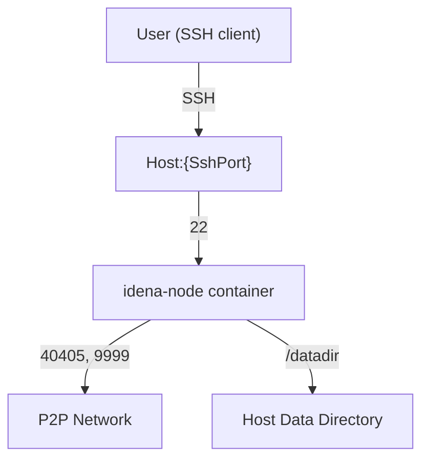

# Idena Node Docker Image

[](https://hub.docker.com/repository/docker/rinzlerfr/idena-node)
[](https://hub.docker.com/repository/docker/rinzlerfr/idena-node)
[](https://hub.docker.com/repository/docker/rinzlerfr/idena-node)
[](https://github.com/Rinzler78/docker.idena-node/stargazers)
[](https://github.com/Rinzler78/docker.idena-node/network/members)
[](https://github.com/Rinzler78/docker.idena-node/issues)
[](https://github.com/Rinzler78/docker.idena-node/commits/master)
[](https://github.com/Rinzler78/docker.idena-node/issues)
[](https://opensource.org/licenses/MIT)

---

## Overview

This repository provides a ready-to-use Docker image to run an Idena node easily and securely, with SSH access and persistent data storage.  
For more information about the Idena project, visit [idena.io](https://idena.io/).

---

## Table of Contents

- [Features](#features)
- [Architecture](#architecture)
- [Prerequisites](#prerequisites)
- [Quick Start](#quick-start)
- [Configuration](#configuration)
- [Usage](#usage)
- [Update Instructions](#update-instructions)
- [Synology NAS Deployment](#synology-nas-deployment)
- [FAQ / Troubleshooting](#faq--troubleshooting)
- [Support](#support)
- [Contributing](#contributing)
- [License](#license)

---

## Features

- Simple deployment of an Idena node via Docker
- SSH access to the container
- Automatic update of the Idena node binary
- Persistent data storage via Docker volumes
- Easy migration from existing nodes
- Public image available on Docker Hub

---

## Architecture



---

## Prerequisites

- Docker (version 20+ recommended)
- Supported OS: Linux, macOS, Windows (with Docker)
- At least 2GB RAM and 2GB free disk space
- Internet connection

---

## Quick Start

```sh
docker run -d \
  --restart unless-stopped \
  -p 60022:22 \
  -p 40405:40405 \
  -p 9999:9999 \
  -v ~/MyDockers/idena-node/datadir:/datadir \
  -e IDENA_USER_ACCOUNT_NAME=idenaUser \
  -e IDENA_USER_ACCOUNT_PASS=idenaUserPassword \
  --name idena-node rinzlerfr/idena-node
```

> **Note:**
> The SSH port mapping (`-p 60022:22`) is required if you want to connect to your node via SSH, for example to use port forwarding with the command:
> ```sh
> ssh -L 9999:localhost:9009 idenaUser@<host_ip> -p 60022
> ```
> Here, `60022` is just an example: you can replace it with any free port of your choice, as long as you use the same port number in both the `docker run` and the `ssh` command.
> This is necessary to allow the Idena desktop application to connect to your remote node as if it were local.

**Replace:**
- `60022` with your desired SSH port
- `~/MyDockers/idena-node/datadir` with your data directory path
- `idenaUser` and `idenaUserPassword` with your SSH credentials

---

## Configuration

| Variable                   | Description                        | Required | Example           |
|----------------------------|------------------------------------|----------|-------------------|
| IDENA_USER_ACCOUNT_NAME    | SSH user account name              | Yes      | idenaUser         |
| IDENA_USER_ACCOUNT_PASS    | SSH user account password          | Yes      | idenaUserPassword |

**Data directory:**  
Create a directory on your host to persist node data and copy your `api.key` into it:

```sh
mkdir -p ~/MyDockers/idena-node/datadir
cp /path/to/your/api.key ~/MyDockers/idena-node/datadir/api.key
```

---

## Usage

### Build the image (optional)

If you want to build the image locally:

```sh
docker build -t idena-node .
```

### Run the container

See [Quick Start](#quick-start).

### Connect to the node from Idena Desktop App

To access your remote node API securely from your local Idena desktop app, use SSH port forwarding:

```sh
ssh -L 9999:localhost:9009 idenaUser@<host_ip> -p 60022
```

Then, in the Idena app, set the node address to:  
`http://localhost:9999`

---

## Update Instructions

1. Pull the latest image:
   ```sh
   docker pull rinzlerfr/idena-node
   ```
2. Stop and remove the existing container (data is preserved):
   ```sh
   docker stop idena-node
   docker rm idena-node
   ```
3. Run the container again with your previous command.

---

## Synology NAS Deployment

1. **Install Docker** via the Package Center.
2. **Search for `rinzlerfr/idena-node`** in the Docker registry and download it.
3. **Create the data directory** (e.g., `docker/idena-node/datadir`).
4. **Copy your `api.key`** into the data directory.
5. **(Optional) Migrate existing node data** by copying all files from your old datadir.
6. **Configure and start the container** via the Docker GUI:
   - Set up volumes, ports, and environment variables as described above.

---

## FAQ / Troubleshooting

### Port already in use

Make sure the ports (22, 40405, 9999) are not used by another service.

### Permission denied on /datadir

Ensure the Docker user has read/write permissions on the mapped directory.

### Cannot SSH into the container

Check SSH port mapping, username, password, and host IP.

### Container does not restart

Use `--restart unless-stopped` in your `docker run` command.

**For other issues, open an issue on GitHub or see [Support](#support).**

---

## Support

- Open an issue on [GitHub](https://github.com/Rinzler78/docker.idena-node/issues)
- Contact: @Rinzler78 (maintainer)

If you find this project useful, donations are welcome:  
`0x3fc4e0d8dcc6d767eb5381abe89f52cad874a8e5`

---

## Contributing

Contributions are welcome!  
Please open an issue or a pull request on [GitHub](https://github.com/Rinzler78/docker.idena-node).

---

## License

MIT — see [LICENSE](LICENSE) for details.

---


